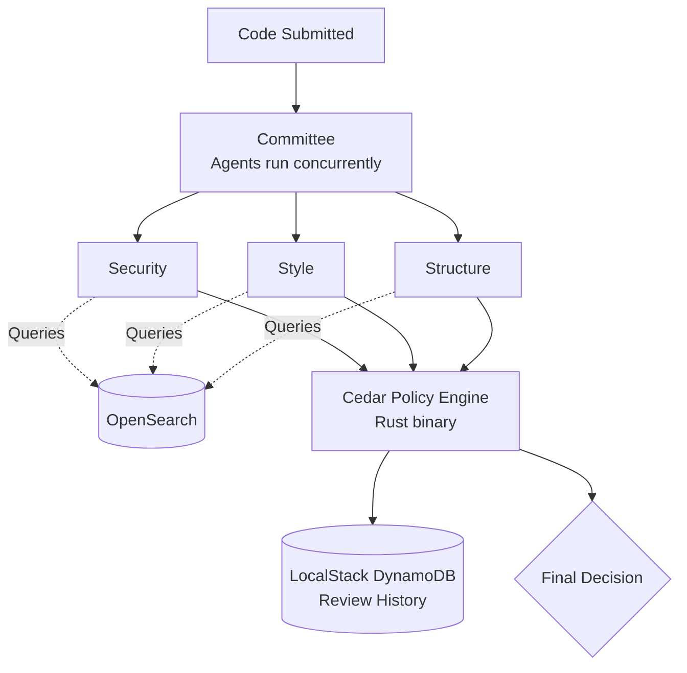

# Code Review Committee

An AI-powered code review system where three independent agents — **Security**, **Style**, and **Structure** — each review the same code and cast a verdict. They don't always agree. A real **Cedar policy engine** decides whose vote actually has the power to block a merge: only Security's.

Built for the **AWS First Commit Hackathon** (BUILD IT track). Runs entirely on your own machine — no AWS account, no cost.

---

## What it does

1. Code is submitted (a fixed test snippet, a real file pulled from GitHub, or every file in a cloned repo).
2. Three agents review it **concurrently**, each with a narrow, enforced scope.
3. Each agent queries **OpenSearch** for similar known-bad patterns before giving its verdict — real retrieval-augmented reasoning.
4. All three verdicts go to a **real Cedar policy engine** — a compiled Rust binary using the actual `cedar-policy` crate, called via subprocess. Only a `BLOCK` from Security can stop the merge.
5. The result is saved to a **LocalStack**-simulated DynamoDB table for review history.
6. Final decision: merge allowed (with any non-blocking suggestions) or merge blocked (with the specific reason).

---

## Architecture



---

## Tech stack

| Tool | Role |
|---|---|
| **Ollama (Llama 3.1)** | Local LLM powering all three agents |
| **Cedar (Rust)** | Real, compiled policy engine enforcing the merge rule |
| **OpenSearch** | Retrieval-augmented context for agent reasoning |
| **LocalStack** | Simulated DynamoDB for review history |
| **Finch** | Containerizes the app + the compiled Cedar binary |
| **Python** | Agent framework, orchestration, glue code |

---

## Setup

### 1. Install Ollama
Download from [ollama.com/download](https://ollama.com/download), then:
```bash
ollama pull llama3.1
```

### 2. Start LocalStack (via Finch)
```bash
finch run -d -p 4566:4566 --name localstack localstack/localstack
python localstack_setup.py
```

### 3. Start OpenSearch (via Finch)
```bash
finch run -d -p 9200:9200 -e "discovery.type=single-node" -e "DISABLE_SECURITY_PLUGIN=true" --name opensearch opensearchproject/opensearch:latest
python opensearch_setup.py
```

### 4. Install Python dependencies
```bash
pip install -r requirements.txt
```

### 5. (Optional) Build the Cedar policy engine
Requires Rust via [rustup](https://rustup.rs) (not your OS package manager — needs a modern toolchain):
```bash
cd swarm
cargo build --release
```

---

## Running it

**Run the fixed demo scenarios:**
```bash
python main.py
```

**Review a real file from any public GitHub repo:**
```bash
python review_github_file.py https://github.com/owner/repo/blob/branch/path/to/file.py
```

**Clone and review multiple files from a real repo:**
```bash
python review_github_repo.py https://github.com/owner/repo --limit 5
```

**Run as a live local API:**
```bash
uvicorn local_server:app --reload
```
Then `POST` to `http://localhost:8000/review` with `{"code": "..."}`.

---

## Project structure

```text
agents/
├── base.py                 — shared agent framework, prompting, parsing, safety net
├── security.py             — Security Reviewer
├── style.py                — Style Reviewer
├── structure.py            — Structure Reviewer
├── retrieval.py            — OpenSearch context lookup
├── orchestrator.py         — Committee class, runs agents concurrently
├── policy_engine.py        — calls the real Cedar binary for the merge decision
├── llm_client.py           — Ollama backend
├── local_server.py         — FastAPI live endpoint
├── main.py                 — CLI demo runner
├── review_github_file.py   — review a single real GitHub file
├── review_github_repo.py   — clone + review a whole real GitHub repo
├── swarm/                  — Rust project for the Cedar policy engine
├── localstack_setup.py     — creates the review-history table
└── opensearch_setup.py     — seeds retrieval reference examples
```

---

## AI tools used

This project was built with the help of **Claude** (Anthropic) for architecture design, debugging, and code generation, as disclosed per the hackathon's rules.

---

## Team

Built by Navistha Pandey and [Teammate Name] for AWS First Commit 2026.
